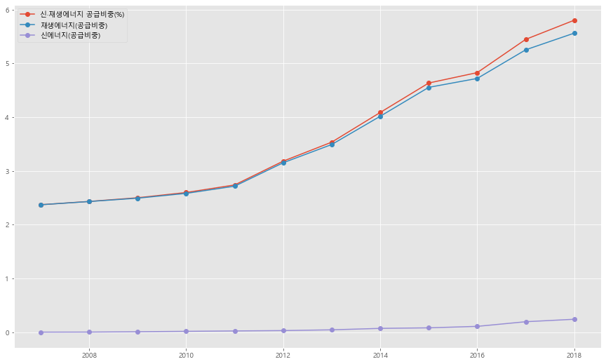
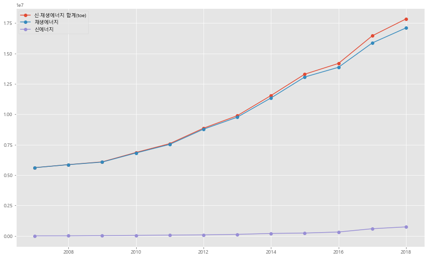
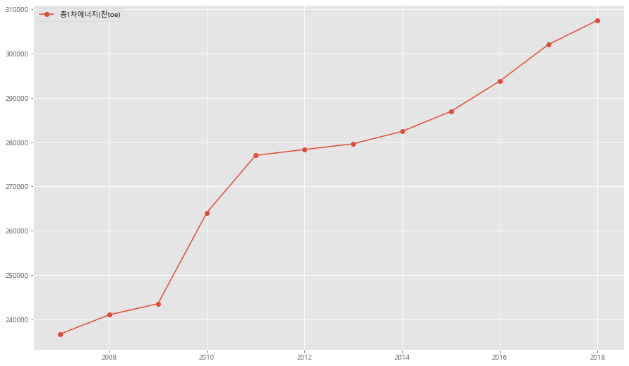
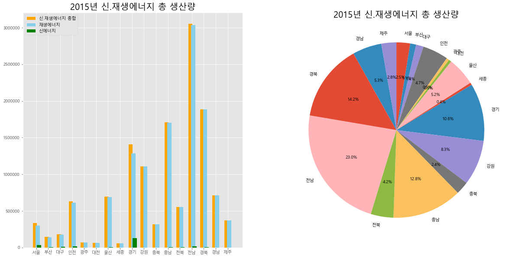
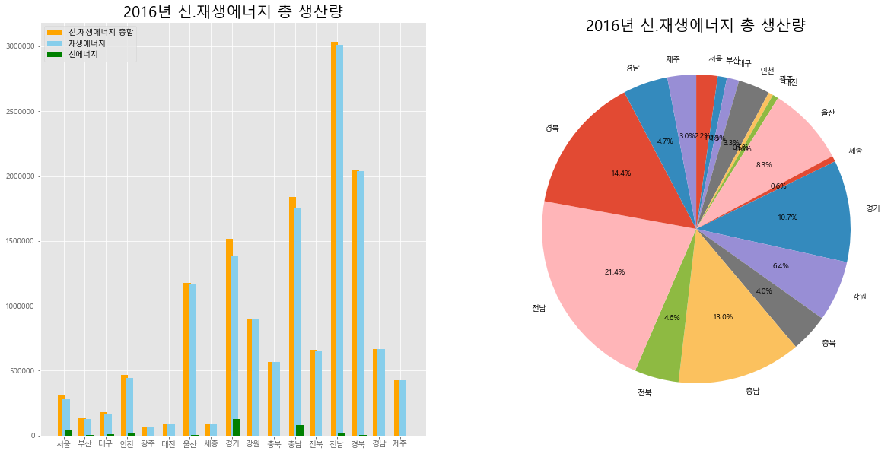
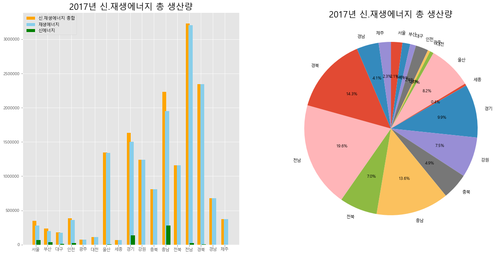
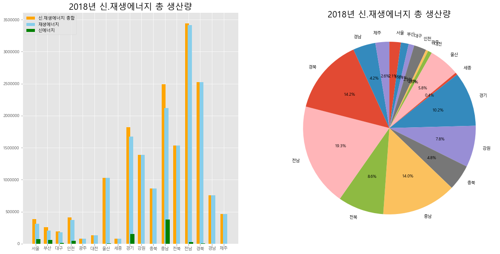
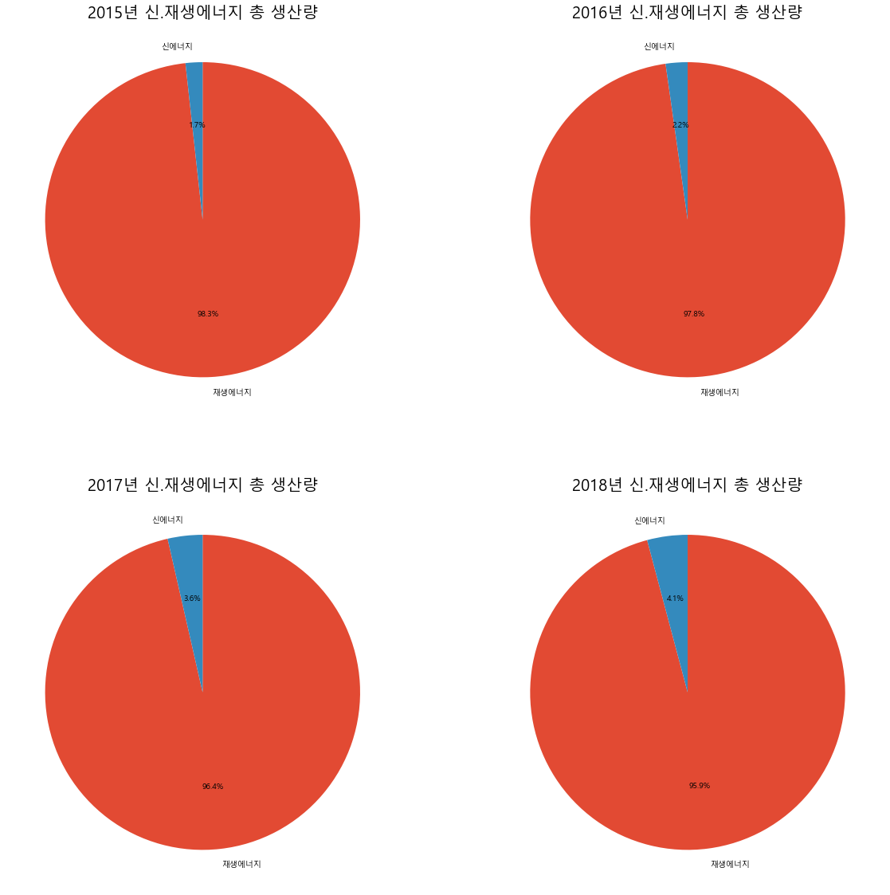

# 종합 에너지 데이터(신.재생에너지 생산량) EDA

### Hwang In Woo

## 목차 
0. 배경


1. 사전 준비


2. 변수 설명


3. 연도별 신.재생에너지 총 생산량


4. 2015년 지역별 신.재생에너지 총 생산량


5. 2016년 지역별 신.재생에너지 총 생산량 


6. 2017년 지역별 신.재생에너지 총 생산량 


7. 2018년 지역별 신.재생에너지 총 생산량 


8. 연도별 신.재생에너지 총 생산량 그래프 정리


9. 연도별 신.재생에너지 총 생산량 비율


10. EDA 결과        

## 0. 배경 
- 우리나라는 에너지 대외 의존도가 높고 유가변동에 의한 영향의 폭이 크고 깊어서 안정적 에너지수급이 중요한 과제로 대두되고 그 중요한 수단 발굴의 필요성이 인식하면서 1987년 12월에 ｢대체에너지개발촉진법｣을 제정․공포하고 1988년부터 본격적으로 기술개발을 지원하기 시작했다.


- 지난 9월 '제4차 신․재생에너지 기술개발 및 이용․보급 기본계획'(2014～2035)을 수립하여 총에너지소비중 신․재생에너지비중을 2035년 11%까지 확대하기 위한 신․재생에너지원별, 기술개발과 보급 세부추진 계획을 수립하였다. 이는 정책적 의지뿐만 아니라 국내 지리적여건, 기술수준, 시장성 등을 감안하여 실제 달성 가능한 비중목표 제시하였으며, 원별로는 폐기물 비중은 축소하고 태양광과 풍력을 핵심원으로 육성할 예정이다.


- 제가 맡은 EDA에서는 신.재생에너지를 총합한 수치의 데이터프레임을 활용하여 연도별 추이와 지역별 현황을 확일 할 예정입니다.


**목표**


- **35년 까지 신재생 보급률 11%달성**

## 1. 사전 준비


```python
%matplotlib inline
import numpy as np
import pandas as pd
import matplotlib.pyplot as plt
from matplotlib import style
```


```python
from matplotlib import font_manager, rc
font_path = 'c://Windows//Fonts//malgun.ttf' # 폰트 파일 위치
font_name = font_manager.FontProperties( fname = font_path ).get_name()
rc( 'font', family = font_name )
```

## 2. 변수 설명
*2-1. 연도별 재.생산에너지 생산량

* 단위(toe) = 지구상에 존재하는 모든 에너지원의 발열량에 기초해서 이를 석유의 발열량으로 환산한 것으로 석유환산톤을 말한다. 각종 에너지의 단위를 비교하기 위한 가상단위라고 볼 수 있다. 1톤의 석유를 완전연소시킬때 얻을 수 있는 에너지량


- 총1차에너지(천toe) : 에너지원 중 천연자원 상태에서 공급되는 에너지(석유, 석탄, 천연가스 등)
- 신·재생에너지 공급비중(%) : 총 에너지에서 신에너지와 재생에너지의 공급비중을 합한 %비율
- 재생에너지(공급비중) : 총에너지에서 재생에너지의 공급비중 %비율
- 신에너지(공급비중) : 총에너지에서 신에너지의 공급비중 %비율
- 신·재생에너지 합계(toe) : 신에너지와 재생에너지 생란량 합계
- 재생에너지 : 재생에너지 생산량
- 신에너지: 신에너지 생산량


*2-2. 연도별 재.생산에너지 생산량


- 각 지역 : 대도시와 각 도별
- 신·재생에너지 합계(toe) : 각 지역별 신.재생에너지 생산량
- 재생에너지 : 각 지역별 재생에너지 생산량
- 신에너지 : 각 지역별 신에너지 생산량


### 3. 연도별 신.재생에너지 총 생산량

#### 데이터 읽기


```python
df = pd.read_csv('연도별 신.재생에너지 공급비중(%).csv')
```


```python
df = df.iloc[:,1:]
df.index = [2007,2008,2009,2010,2011,2012,2013,2014,2015,2016,2017,2018]
```


```python
df
```


<div>
<style scoped>
    .dataframe tbody tr th:only-of-type {
        vertical-align: middle;
    }

    .dataframe tbody tr th {
        vertical-align: top;
    }

    .dataframe thead th {
        text-align: right;
    }
</style>
<table border="1" class="dataframe">
  <thead>
    <tr style="text-align: right;">
      <th></th>
      <th>신·재생에너지 공급비중(%)</th>
      <th>재생에너지(공급비중)</th>
      <th>신에너지(공급비중)</th>
    </tr>
  </thead>
  <tbody>
    <tr>
      <th>2007</th>
      <td>2.369792</td>
      <td>2.369018</td>
      <td>0.000774</td>
    </tr>
    <tr>
      <th>2008</th>
      <td>2.430966</td>
      <td>2.429153</td>
      <td>0.001812</td>
    </tr>
    <tr>
      <th>2009</th>
      <td>2.499486</td>
      <td>2.491604</td>
      <td>0.007882</td>
    </tr>
    <tr>
      <th>2010</th>
      <td>2.596831</td>
      <td>2.580793</td>
      <td>0.016039</td>
    </tr>
    <tr>
      <th>2011</th>
      <td>2.737519</td>
      <td>2.714651</td>
      <td>0.022868</td>
    </tr>
    <tr>
      <th>2012</th>
      <td>3.180001</td>
      <td>3.150356</td>
      <td>0.029645</td>
    </tr>
    <tr>
      <th>2013</th>
      <td>3.533045</td>
      <td>3.489266</td>
      <td>0.043779</td>
    </tr>
    <tr>
      <th>2014</th>
      <td>4.085137</td>
      <td>4.014544</td>
      <td>0.070592</td>
    </tr>
    <tr>
      <th>2015</th>
      <td>4.632801</td>
      <td>4.552135</td>
      <td>0.080666</td>
    </tr>
    <tr>
      <th>2016</th>
      <td>4.826232</td>
      <td>4.718082</td>
      <td>0.108150</td>
    </tr>
    <tr>
      <th>2017</th>
      <td>5.445293</td>
      <td>5.250911</td>
      <td>0.194383</td>
    </tr>
    <tr>
      <th>2018</th>
      <td>5.800796</td>
      <td>5.560527</td>
      <td>0.240270</td>
    </tr>
  </tbody>
</table>
</div>


```python
df.plot(figsize = (15, 9), marker = 'o')
```


    <matplotlib.axes._subplots.AxesSubplot at 0x2c2bb2e1108>





- 신·재생에너지 공급비중에는 전체 합계에서 재생에너지가 대부분을 차지하고 신에너지는 아직 공급비중이 현저히 낮다는 것을 확인 할 수 있다. 


- 재생에너지의 공급비중은 11년 이후로 지속적으로 크게 증가중이다.


```python
df1 = pd.read_csv('연도별 신.재생에너지 생산량.csv', index_col = 0 )
```


```python
df1
```


<div>
<style scoped>
    .dataframe tbody tr th:only-of-type {
        vertical-align: middle;
    }

    .dataframe tbody tr th {
        vertical-align: top;
    }

    .dataframe thead th {
        text-align: right;
    }
</style>
<table border="1" class="dataframe">
  <thead>
    <tr style="text-align: right;">
      <th></th>
      <th>신·재생에너지 합계(toe)</th>
      <th>재생에너지</th>
      <th>신에너지</th>
    </tr>
  </thead>
  <tbody>
    <tr>
      <th>2007</th>
      <td>5.608776e+06</td>
      <td>5.606944e+06</td>
      <td>1832.000000</td>
    </tr>
    <tr>
      <th>2008</th>
      <td>5.858481e+06</td>
      <td>5.854113e+06</td>
      <td>4367.000000</td>
    </tr>
    <tr>
      <th>2009</th>
      <td>6.086249e+06</td>
      <td>6.067056e+06</td>
      <td>19193.000000</td>
    </tr>
    <tr>
      <th>2010</th>
      <td>6.856284e+06</td>
      <td>6.813938e+06</td>
      <td>42347.000000</td>
    </tr>
    <tr>
      <th>2011</th>
      <td>7.582845e+06</td>
      <td>7.519502e+06</td>
      <td>63344.000000</td>
    </tr>
    <tr>
      <th>2012</th>
      <td>8.850739e+06</td>
      <td>8.768229e+06</td>
      <td>82510.000000</td>
    </tr>
    <tr>
      <th>2013</th>
      <td>9.879207e+06</td>
      <td>9.756791e+06</td>
      <td>122416.000000</td>
    </tr>
    <tr>
      <th>2014</th>
      <td>1.153737e+07</td>
      <td>1.133800e+07</td>
      <td>199369.000000</td>
    </tr>
    <tr>
      <th>2015</th>
      <td>1.329299e+07</td>
      <td>1.306153e+07</td>
      <td>231458.000000</td>
    </tr>
    <tr>
      <th>2016</th>
      <td>1.417841e+07</td>
      <td>1.386069e+07</td>
      <td>317720.000000</td>
    </tr>
    <tr>
      <th>2017</th>
      <td>1.644838e+07</td>
      <td>1.586122e+07</td>
      <td>587164.037000</td>
    </tr>
    <tr>
      <th>2018</th>
      <td>1.783751e+07</td>
      <td>1.709868e+07</td>
      <td>738831.485698</td>
    </tr>
  </tbody>
</table>
</div>


```python
df1.plot(figsize = (15, 9), marker = 'o')
```


    <matplotlib.axes._subplots.AxesSubplot at 0x2c2ba7e13c8>





- 신·재생에너지 생산량에는 전체 합계에서 재생에너지가 대부분을 차지하고 신에너지는 아직 에너지생산량이 현저히 낮다는 것을 확인 할 수 있다. 


- 신.재생에너지의 생산량도 11녀 이후로 지속적으로 증가하는 추세


```python
df2 = pd.read_csv('총1차에너지.csv', index_col = 0)
```


```python
df2
```


<div>
<style scoped>
    .dataframe tbody tr th:only-of-type {
        vertical-align: middle;
    }

    .dataframe tbody tr th {
        vertical-align: top;
    }

    .dataframe thead th {
        text-align: right;
    }
</style>
<table border="1" class="dataframe">
  <thead>
    <tr style="text-align: right;">
      <th></th>
      <th>총1차에너지(천toe)</th>
    </tr>
  </thead>
  <tbody>
    <tr>
      <th>2007</th>
      <td>236678</td>
    </tr>
    <tr>
      <th>2008</th>
      <td>240994</td>
    </tr>
    <tr>
      <th>2009</th>
      <td>243500</td>
    </tr>
    <tr>
      <th>2010</th>
      <td>264053</td>
    </tr>
    <tr>
      <th>2011</th>
      <td>276997</td>
    </tr>
    <tr>
      <th>2012</th>
      <td>278325</td>
    </tr>
    <tr>
      <th>2013</th>
      <td>279623</td>
    </tr>
    <tr>
      <th>2014</th>
      <td>282423</td>
    </tr>
    <tr>
      <th>2015</th>
      <td>286932</td>
    </tr>
    <tr>
      <th>2016</th>
      <td>293778</td>
    </tr>
    <tr>
      <th>2017</th>
      <td>302066</td>
    </tr>
    <tr>
      <th>2018</th>
      <td>307501</td>
    </tr>
  </tbody>
</table>
</div>


```python
df2.plot(figsize = (15, 9), marker = 'o')
```


    <matplotlib.axes._subplots.AxesSubplot at 0x2c2b837af48>





- 신에너지, 재생에너지를 뺀 1차 에너지들의 생산량 총 합은 2018년 까지 꾸준히 증가하는 추세이지만 11년까지 총 1차에너지의 생산량이 크게 증가하였다가 11년 이후로는 완만한 곡선으로 증가하고 있다.

### 결과
- 11년 이후 1차에너지의 생산량의 증가폭이 낮아지고 신.재생에너지 생산량의 증가폭이 높아진 것을 알 수 있다.

## 4. 2015 지역별 신.재생에너지 총 생산량

#### 기본통계


```python
tf11 = pd.read_csv('2015년 지역별 신.재생에너지 총 생산량 기본통계.csv', index_col = 0)
```


```python
tf11
```


<div>
<style scoped>
    .dataframe tbody tr th:only-of-type {
        vertical-align: middle;
    }

    .dataframe tbody tr th {
        vertical-align: top;
    }

    .dataframe thead th {
        text-align: right;
    }
</style>
<table border="1" class="dataframe">
  <thead>
    <tr style="text-align: right;">
      <th></th>
      <th>신·재생에너지 합계(toe)</th>
      <th>재생에너지</th>
      <th>신에너지</th>
    </tr>
  </thead>
  <tbody>
    <tr>
      <th>count</th>
      <td>1.700000e+01</td>
      <td>1.700000e+01</td>
      <td>17.000000</td>
    </tr>
    <tr>
      <th>mean</th>
      <td>7.819401e+05</td>
      <td>7.683249e+05</td>
      <td>13615.176471</td>
    </tr>
    <tr>
      <th>std</th>
      <td>8.187092e+05</td>
      <td>8.120271e+05</td>
      <td>31009.360154</td>
    </tr>
    <tr>
      <th>min</th>
      <td>5.787800e+04</td>
      <td>5.787800e+04</td>
      <td>0.000000</td>
    </tr>
    <tr>
      <th>25%</th>
      <td>1.825280e+05</td>
      <td>1.728020e+05</td>
      <td>44.000000</td>
    </tr>
    <tr>
      <th>50%</th>
      <td>5.551040e+05</td>
      <td>5.525730e+05</td>
      <td>3411.000000</td>
    </tr>
    <tr>
      <th>75%</th>
      <td>1.105802e+06</td>
      <td>1.105758e+06</td>
      <td>9726.000000</td>
    </tr>
    <tr>
      <th>max</th>
      <td>3.053159e+06</td>
      <td>3.037676e+06</td>
      <td>128009.000000</td>
    </tr>
  </tbody>
</table>
</div>


- 2015년 각 지역별 재셍에너지, 신에너지, 두개의 합에 대한 기본통계


```python
tf = pd.read_csv('2015년 지역별 신.재생에너지 총 생산량.csv', index_col = 0)
```


```python
tf
```


<div>
<style scoped>
    .dataframe tbody tr th:only-of-type {
        vertical-align: middle;
    }

    .dataframe tbody tr th {
        vertical-align: top;
    }

    .dataframe thead th {
        text-align: right;
    }
</style>
<table border="1" class="dataframe">
  <thead>
    <tr style="text-align: right;">
      <th></th>
      <th>신재생에너지_합계</th>
      <th>재생에너지</th>
      <th>신에너지</th>
    </tr>
  </thead>
  <tbody>
    <tr>
      <th>서울</th>
      <td>335295</td>
      <td>298327</td>
      <td>36968</td>
    </tr>
    <tr>
      <th>부산</th>
      <td>145572</td>
      <td>140254</td>
      <td>5318</td>
    </tr>
    <tr>
      <th>대구</th>
      <td>182528</td>
      <td>172802</td>
      <td>9726</td>
    </tr>
    <tr>
      <th>인천</th>
      <td>628328</td>
      <td>609803</td>
      <td>18525</td>
    </tr>
    <tr>
      <th>광주</th>
      <td>67587</td>
      <td>67065</td>
      <td>522</td>
    </tr>
    <tr>
      <th>대전</th>
      <td>65131</td>
      <td>65087</td>
      <td>44</td>
    </tr>
    <tr>
      <th>울산</th>
      <td>694169</td>
      <td>689305</td>
      <td>4864</td>
    </tr>
    <tr>
      <th>세종</th>
      <td>57878</td>
      <td>57878</td>
      <td>0</td>
    </tr>
    <tr>
      <th>경기</th>
      <td>1409594</td>
      <td>1281585</td>
      <td>128009</td>
    </tr>
    <tr>
      <th>강원</th>
      <td>1105802</td>
      <td>1105758</td>
      <td>44</td>
    </tr>
    <tr>
      <th>충북</th>
      <td>318637</td>
      <td>318633</td>
      <td>4</td>
    </tr>
    <tr>
      <th>충남</th>
      <td>1707231</td>
      <td>1701236</td>
      <td>5995</td>
    </tr>
    <tr>
      <th>전북</th>
      <td>555104</td>
      <td>552573</td>
      <td>2531</td>
    </tr>
    <tr>
      <th>전남</th>
      <td>3053159</td>
      <td>3037676</td>
      <td>15483</td>
    </tr>
    <tr>
      <th>경북</th>
      <td>1888610</td>
      <td>1885199</td>
      <td>3411</td>
    </tr>
    <tr>
      <th>경남</th>
      <td>710934</td>
      <td>710920</td>
      <td>14</td>
    </tr>
    <tr>
      <th>제주</th>
      <td>367422</td>
      <td>367422</td>
      <td>0</td>
    </tr>
  </tbody>
</table>
</div>


## 5. 2016년 지역별 신·재생에너지 총 생산량

#### 기본통계


```python
af = pd.read_csv('2016년 신.재생에너지 기본통계.csv', index_col = 0)
```


```python
af
```


<div>
<style scoped>
    .dataframe tbody tr th:only-of-type {
        vertical-align: middle;
    }

    .dataframe tbody tr th {
        vertical-align: top;
    }

    .dataframe thead th {
        text-align: right;
    }
</style>
<table border="1" class="dataframe">
  <thead>
    <tr style="text-align: right;">
      <th></th>
      <th>신·재생에너지 합계(toe)</th>
      <th>재생에너지</th>
      <th>신에너지</th>
    </tr>
  </thead>
  <tbody>
    <tr>
      <th>count</th>
      <td>1.700000e+01</td>
      <td>1.700000e+01</td>
      <td>17.000000</td>
    </tr>
    <tr>
      <th>mean</th>
      <td>8.340234e+05</td>
      <td>8.153342e+05</td>
      <td>18688.882353</td>
    </tr>
    <tr>
      <th>std</th>
      <td>8.371665e+05</td>
      <td>8.239516e+05</td>
      <td>34507.062067</td>
    </tr>
    <tr>
      <th>min</th>
      <td>7.021400e+04</td>
      <td>6.966800e+04</td>
      <td>0.000000</td>
    </tr>
    <tr>
      <th>25%</th>
      <td>1.818570e+05</td>
      <td>1.709450e+05</td>
      <td>50.000000</td>
    </tr>
    <tr>
      <th>50%</th>
      <td>5.683580e+05</td>
      <td>5.683320e+05</td>
      <td>2396.000000</td>
    </tr>
    <tr>
      <th>75%</th>
      <td>1.176786e+06</td>
      <td>1.172800e+06</td>
      <td>23849.000000</td>
    </tr>
    <tr>
      <th>max</th>
      <td>3.034387e+06</td>
      <td>3.009489e+06</td>
      <td>124763.000000</td>
    </tr>
  </tbody>
</table>
</div>


- 2016년 신.재생에너지 총 생산량 기본통계


```python
af1 = pd.read_csv('2016년 신.재생에너지 생산량 합.csv', index_col = 0)
```


```python
af1
```


<div>
<style scoped>
    .dataframe tbody tr th:only-of-type {
        vertical-align: middle;
    }

    .dataframe tbody tr th {
        vertical-align: top;
    }

    .dataframe thead th {
        text-align: right;
    }
</style>
<table border="1" class="dataframe">
  <thead>
    <tr style="text-align: right;">
      <th></th>
      <th>신재생에너지_합계</th>
      <th>재생에너지</th>
      <th>신에너지</th>
    </tr>
  </thead>
  <tbody>
    <tr>
      <th>서울</th>
      <td>316805</td>
      <td>278669</td>
      <td>38136</td>
    </tr>
    <tr>
      <th>부산</th>
      <td>135771</td>
      <td>129365</td>
      <td>6406</td>
    </tr>
    <tr>
      <th>대구</th>
      <td>181857</td>
      <td>170945</td>
      <td>10911</td>
    </tr>
    <tr>
      <th>인천</th>
      <td>469248</td>
      <td>445398</td>
      <td>23849</td>
    </tr>
    <tr>
      <th>광주</th>
      <td>70214</td>
      <td>69668</td>
      <td>546</td>
    </tr>
    <tr>
      <th>대전</th>
      <td>86762</td>
      <td>86698</td>
      <td>64</td>
    </tr>
    <tr>
      <th>울산</th>
      <td>1176786</td>
      <td>1172800</td>
      <td>3986</td>
    </tr>
    <tr>
      <th>세종</th>
      <td>84701</td>
      <td>84701</td>
      <td>0</td>
    </tr>
    <tr>
      <th>경기</th>
      <td>1514250</td>
      <td>1389487</td>
      <td>124763</td>
    </tr>
    <tr>
      <th>강원</th>
      <td>902962</td>
      <td>902919</td>
      <td>42</td>
    </tr>
    <tr>
      <th>충북</th>
      <td>568358</td>
      <td>568332</td>
      <td>26</td>
    </tr>
    <tr>
      <th>충남</th>
      <td>1840830</td>
      <td>1759599</td>
      <td>81231</td>
    </tr>
    <tr>
      <th>전북</th>
      <td>658316</td>
      <td>657907</td>
      <td>408</td>
    </tr>
    <tr>
      <th>전남</th>
      <td>3034387</td>
      <td>3009489</td>
      <td>24897</td>
    </tr>
    <tr>
      <th>경북</th>
      <td>2043004</td>
      <td>2040607</td>
      <td>2396</td>
    </tr>
    <tr>
      <th>경남</th>
      <td>667175</td>
      <td>667125</td>
      <td>50</td>
    </tr>
    <tr>
      <th>제주</th>
      <td>426972</td>
      <td>426972</td>
      <td>0</td>
    </tr>
  </tbody>
</table>
</div>


## 6. 2017년 신.재생에너지 총 생산량 

#### 2017년 신.재생에너지 데이터프레임


```python
sf1 = pd.read_csv('2017년 신.재생에너지 총 생산량.csv', index_col = 0)
```


```python
sf1
```


<div>
<style scoped>
    .dataframe tbody tr th:only-of-type {
        vertical-align: middle;
    }

    .dataframe tbody tr th {
        vertical-align: top;
    }

    .dataframe thead th {
        text-align: right;
    }
</style>
<table border="1" class="dataframe">
  <thead>
    <tr style="text-align: right;">
      <th></th>
      <th>신재생에너지_합계</th>
      <th>재생에너지</th>
      <th>신에너지</th>
    </tr>
  </thead>
  <tbody>
    <tr>
      <th>서울</th>
      <td>350880</td>
      <td>281191</td>
      <td>69688</td>
    </tr>
    <tr>
      <th>부산</th>
      <td>237438</td>
      <td>198505</td>
      <td>38933</td>
    </tr>
    <tr>
      <th>대구</th>
      <td>179156</td>
      <td>170257</td>
      <td>8899</td>
    </tr>
    <tr>
      <th>인천</th>
      <td>387825</td>
      <td>362573</td>
      <td>25252</td>
    </tr>
    <tr>
      <th>광주</th>
      <td>73199</td>
      <td>72652</td>
      <td>546</td>
    </tr>
    <tr>
      <th>대전</th>
      <td>113836</td>
      <td>113750</td>
      <td>85</td>
    </tr>
    <tr>
      <th>울산</th>
      <td>1343420</td>
      <td>1338988</td>
      <td>4432</td>
    </tr>
    <tr>
      <th>세종</th>
      <td>65440</td>
      <td>65440</td>
      <td>0</td>
    </tr>
    <tr>
      <th>경기</th>
      <td>1634363</td>
      <td>1501521</td>
      <td>132841</td>
    </tr>
    <tr>
      <th>강원</th>
      <td>1237809</td>
      <td>1237768</td>
      <td>41</td>
    </tr>
    <tr>
      <th>충북</th>
      <td>806868</td>
      <td>806806</td>
      <td>61</td>
    </tr>
    <tr>
      <th>충남</th>
      <td>2231253</td>
      <td>1951391</td>
      <td>279861</td>
    </tr>
    <tr>
      <th>전북</th>
      <td>1158328</td>
      <td>1158139</td>
      <td>189</td>
    </tr>
    <tr>
      <th>전남</th>
      <td>3229555</td>
      <td>3206708</td>
      <td>22847</td>
    </tr>
    <tr>
      <th>경북</th>
      <td>2345137</td>
      <td>2341743</td>
      <td>3394</td>
    </tr>
    <tr>
      <th>경남</th>
      <td>679022</td>
      <td>678933</td>
      <td>88</td>
    </tr>
    <tr>
      <th>제주</th>
      <td>374842</td>
      <td>374842</td>
      <td>0</td>
    </tr>
  </tbody>
</table>
</div>


#### 기본통계


```python
sf = pd.read_csv('2017년 신.재생에너지 총 생산량 기본통계.csv', index_col = 0)
```


```python
sf
```


<div>
<style scoped>
    .dataframe tbody tr th:only-of-type {
        vertical-align: middle;
    }

    .dataframe tbody tr th {
        vertical-align: top;
    }

    .dataframe thead th {
        text-align: right;
    }
</style>
<table border="1" class="dataframe">
  <thead>
    <tr style="text-align: right;">
      <th></th>
      <th>신·재생에너지 합계(toe)</th>
      <th>재생에너지</th>
      <th>신에너지</th>
    </tr>
  </thead>
  <tbody>
    <tr>
      <th>count</th>
      <td>1.700000e+01</td>
      <td>1.700000e+01</td>
      <td>17.000000</td>
    </tr>
    <tr>
      <th>mean</th>
      <td>7.819401e+05</td>
      <td>7.683249e+05</td>
      <td>13615.176471</td>
    </tr>
    <tr>
      <th>std</th>
      <td>8.187092e+05</td>
      <td>8.120271e+05</td>
      <td>31009.360154</td>
    </tr>
    <tr>
      <th>min</th>
      <td>5.787800e+04</td>
      <td>5.787800e+04</td>
      <td>0.000000</td>
    </tr>
    <tr>
      <th>25%</th>
      <td>1.825280e+05</td>
      <td>1.728020e+05</td>
      <td>44.000000</td>
    </tr>
    <tr>
      <th>50%</th>
      <td>5.551040e+05</td>
      <td>5.525730e+05</td>
      <td>3411.000000</td>
    </tr>
    <tr>
      <th>75%</th>
      <td>1.105802e+06</td>
      <td>1.105758e+06</td>
      <td>9726.000000</td>
    </tr>
    <tr>
      <th>max</th>
      <td>3.053159e+06</td>
      <td>3.037676e+06</td>
      <td>128009.000000</td>
    </tr>
  </tbody>
</table>
</div>


- 2018년 지역별 신.재생에너지 생산량 기본통계

## 7. 2018년 신.재생에너지 총 생산량

#### 2018년 신.재생에너지 데이터프레임


```python
wf1 = pd.read_csv('2018년 신.재생에너지 생산량 합.csv', index_col = 0)
```


```python
wf1
```


<div>
<style scoped>
    .dataframe tbody tr th:only-of-type {
        vertical-align: middle;
    }

    .dataframe tbody tr th {
        vertical-align: top;
    }

    .dataframe thead th {
        text-align: right;
    }
</style>
<table border="1" class="dataframe">
  <thead>
    <tr style="text-align: right;">
      <th></th>
      <th>신재생에너지_합계</th>
      <th>재생에너지</th>
      <th>신에너지</th>
    </tr>
  </thead>
  <tbody>
    <tr>
      <th>서울</th>
      <td>381545</td>
      <td>313114</td>
      <td>68431</td>
    </tr>
    <tr>
      <th>부산</th>
      <td>259304</td>
      <td>203601</td>
      <td>55702</td>
    </tr>
    <tr>
      <th>대구</th>
      <td>189913</td>
      <td>181005</td>
      <td>8908</td>
    </tr>
    <tr>
      <th>인천</th>
      <td>412625</td>
      <td>368351</td>
      <td>44273</td>
    </tr>
    <tr>
      <th>광주</th>
      <td>79351</td>
      <td>78804</td>
      <td>547</td>
    </tr>
    <tr>
      <th>대전</th>
      <td>132408</td>
      <td>132313</td>
      <td>95</td>
    </tr>
    <tr>
      <th>울산</th>
      <td>1030337</td>
      <td>1026750</td>
      <td>3587</td>
    </tr>
    <tr>
      <th>세종</th>
      <td>76201</td>
      <td>76198</td>
      <td>3</td>
    </tr>
    <tr>
      <th>경기</th>
      <td>1821078</td>
      <td>1670146</td>
      <td>150931</td>
    </tr>
    <tr>
      <th>강원</th>
      <td>1386743</td>
      <td>1386660</td>
      <td>83</td>
    </tr>
    <tr>
      <th>충북</th>
      <td>859703</td>
      <td>859631</td>
      <td>72</td>
    </tr>
    <tr>
      <th>충남</th>
      <td>2493271</td>
      <td>2116419</td>
      <td>376851</td>
    </tr>
    <tr>
      <th>전북</th>
      <td>1531690</td>
      <td>1530831</td>
      <td>859</td>
    </tr>
    <tr>
      <th>전남</th>
      <td>3439727</td>
      <td>3413708</td>
      <td>26019</td>
    </tr>
    <tr>
      <th>경북</th>
      <td>2524273</td>
      <td>2521943</td>
      <td>2329</td>
    </tr>
    <tr>
      <th>경남</th>
      <td>753622</td>
      <td>753488</td>
      <td>134</td>
    </tr>
    <tr>
      <th>제주</th>
      <td>465707</td>
      <td>465707</td>
      <td>0</td>
    </tr>
  </tbody>
</table>
</div>


#### 기본통계


```python
wf = pd.read_csv('2018년 지역별 신.재생에너지 총 생산량 기봉통계.csv', index_col = 0)
```


```python
wf
```


<div>
<style scoped>
    .dataframe tbody tr th:only-of-type {
        vertical-align: middle;
    }

    .dataframe tbody tr th {
        vertical-align: top;
    }

    .dataframe thead th {
        text-align: right;
    }
</style>
<table border="1" class="dataframe">
  <thead>
    <tr style="text-align: right;">
      <th></th>
      <th>신·재생에너지 합계(toe)</th>
      <th>재생에너지</th>
      <th>신에너지</th>
    </tr>
  </thead>
  <tbody>
    <tr>
      <th>count</th>
      <td>1.700000e+01</td>
      <td>1.700000e+01</td>
      <td>17.000000</td>
    </tr>
    <tr>
      <th>mean</th>
      <td>1.049265e+06</td>
      <td>1.005804e+06</td>
      <td>43460.235294</td>
    </tr>
    <tr>
      <th>std</th>
      <td>1.010061e+06</td>
      <td>9.767883e+05</td>
      <td>94607.313064</td>
    </tr>
    <tr>
      <th>min</th>
      <td>7.620100e+04</td>
      <td>7.619800e+04</td>
      <td>0.000000</td>
    </tr>
    <tr>
      <th>25%</th>
      <td>2.593040e+05</td>
      <td>2.036010e+05</td>
      <td>95.000000</td>
    </tr>
    <tr>
      <th>50%</th>
      <td>7.536220e+05</td>
      <td>7.534880e+05</td>
      <td>2329.000000</td>
    </tr>
    <tr>
      <th>75%</th>
      <td>1.531690e+06</td>
      <td>1.530831e+06</td>
      <td>44273.000000</td>
    </tr>
    <tr>
      <th>max</th>
      <td>3.439727e+06</td>
      <td>3.413708e+06</td>
      <td>376851.000000</td>
    </tr>
  </tbody>
</table>
</div>


- 2018년 지역별 신.재생에너지 생산량 기본통계

## 8. 연도별 신.재생에너지 총 생산량 그래프 정리

### 2015년


```python
fig = plt.figure( figsize = ( 20, 10 ) )   
ax1 = fig.add_subplot( 1, 2, 1 )
ax2 = fig.add_subplot( 1, 2, 2 )
width = 0.35
labels = ['서울', '부산', '대구', '인천', '광주', '대전', '울산', '세종', '경기', '강원', '충북', '충남',
       '전북', '전남', '경북', '경남', '제주']
x= np.arange(len(labels))
ax1.bar( x -width/3 , tf.신재생에너지_합계,width, color = 'orange', label = '신.재생에너지 총합')
ax1.bar( x +width/3 , tf.재생에너지,width, color = 'skyblue',label = '재생에너지')
ax1.bar( x +2*width/3 , tf.신에너지,width, color = 'green',label = '신에너지')
ax2.pie(tf.신재생에너지_합계,labels = tf.index, autopct = '%.1f%%', startangle = 90, counterclock = False)

ax1.set_xticks(x)
ax1.set_xticklabels(labels)
ax1.legend( loc = 'best' )

ax1.set_title('2015년 신.재생에너지 총 생산량',size=20)
ax2.set_title('2015년 신.재생에너지 총 생산량',size=20)
```


    Text(0.5, 1.0, '2015년 신.재생에너지 총 생산량')





```python
# 신.재생에너지_합계 TOP 5
tf.sort_values(by='신재생에너지_합계' ,ascending=False).head()
```


<div>
<style scoped>
    .dataframe tbody tr th:only-of-type {
        vertical-align: middle;
    }

    .dataframe tbody tr th {
        vertical-align: top;
    }

    .dataframe thead th {
        text-align: right;
    }
</style>
<table border="1" class="dataframe">
  <thead>
    <tr style="text-align: right;">
      <th></th>
      <th>신재생에너지_합계</th>
      <th>재생에너지</th>
      <th>신에너지</th>
    </tr>
  </thead>
  <tbody>
    <tr>
      <th>전남</th>
      <td>3053159</td>
      <td>3037676</td>
      <td>15483</td>
    </tr>
    <tr>
      <th>경북</th>
      <td>1888610</td>
      <td>1885199</td>
      <td>3411</td>
    </tr>
    <tr>
      <th>충남</th>
      <td>1707231</td>
      <td>1701236</td>
      <td>5995</td>
    </tr>
    <tr>
      <th>경기</th>
      <td>1409594</td>
      <td>1281585</td>
      <td>128009</td>
    </tr>
    <tr>
      <th>강원</th>
      <td>1105802</td>
      <td>1105758</td>
      <td>44</td>
    </tr>
  </tbody>
</table>
</div>


```python
# 신.재생에너지_합계 BOTTOM 5
tf.sort_values(by='신재생에너지_합계' ,ascending=True).head()
```


<div>
<style scoped>
    .dataframe tbody tr th:only-of-type {
        vertical-align: middle;
    }

    .dataframe tbody tr th {
        vertical-align: top;
    }

    .dataframe thead th {
        text-align: right;
    }
</style>
<table border="1" class="dataframe">
  <thead>
    <tr style="text-align: right;">
      <th></th>
      <th>신재생에너지_합계</th>
      <th>재생에너지</th>
      <th>신에너지</th>
    </tr>
  </thead>
  <tbody>
    <tr>
      <th>세종</th>
      <td>57878</td>
      <td>57878</td>
      <td>0</td>
    </tr>
    <tr>
      <th>대전</th>
      <td>65131</td>
      <td>65087</td>
      <td>44</td>
    </tr>
    <tr>
      <th>광주</th>
      <td>67587</td>
      <td>67065</td>
      <td>522</td>
    </tr>
    <tr>
      <th>부산</th>
      <td>145572</td>
      <td>140254</td>
      <td>5318</td>
    </tr>
    <tr>
      <th>대구</th>
      <td>182528</td>
      <td>172802</td>
      <td>9726</td>
    </tr>
  </tbody>
</table>
</div>


-> 2015년 지역별 신재생에너지 생산량이 높은 지역은 (전남, 경북, 충남)이고 상대적으로 (세종, 대전, 광주)가 낮은 지역으로 확인됨


-> 재생에너지는 신재생에너지 생산량의 추세와 비슷하고 신에너지 생산량은 (경기, 서울, 전남) 순이다

### 2016년


```python
fig = plt.figure( figsize = ( 20, 10 ) )   
ax1 = fig.add_subplot( 1, 2, 1 )
ax2 = fig.add_subplot( 1, 2, 2 )
width = 0.35
labels = ['서울', '부산', '대구', '인천', '광주', '대전', '울산', '세종', '경기', '강원', '충북', '충남',
       '전북', '전남', '경북', '경남', '제주']
x= np.arange(len(labels))
ax1.bar( x -width/3 , af1.신재생에너지_합계,width, color = 'orange', label = '신.재생에너지 총합')
ax1.bar( x +width/3 , af1.재생에너지,width, color = 'skyblue',label = '재생에너지')
ax1.bar( x +2*width/3 , af1.신에너지,width, color = 'green',label = '신에너지')
ax2.pie(af1.신재생에너지_합계,labels = af1.index, autopct = '%.1f%%', startangle = 90, counterclock = False)

ax1.set_xticks(x)
ax1.set_xticklabels(labels)
ax1.legend( loc = 'best' )

ax1.set_title('2016년 신.재생에너지 총 생산량',size=20)
ax2.set_title('2016년 신.재생에너지 총 생산량',size=20)
```


    Text(0.5, 1.0, '2016년 신.재생에너지 총 생산량')





```python
# 신.재생에너지_합계 TOP 5
af1.sort_values(by='신재생에너지_합계' ,ascending=False).head()
```


<div>
<style scoped>
    .dataframe tbody tr th:only-of-type {
        vertical-align: middle;
    }

    .dataframe tbody tr th {
        vertical-align: top;
    }

    .dataframe thead th {
        text-align: right;
    }
</style>
<table border="1" class="dataframe">
  <thead>
    <tr style="text-align: right;">
      <th></th>
      <th>신재생에너지_합계</th>
      <th>재생에너지</th>
      <th>신에너지</th>
    </tr>
  </thead>
  <tbody>
    <tr>
      <th>전남</th>
      <td>3034387</td>
      <td>3009489</td>
      <td>24897</td>
    </tr>
    <tr>
      <th>경북</th>
      <td>2043004</td>
      <td>2040607</td>
      <td>2396</td>
    </tr>
    <tr>
      <th>충남</th>
      <td>1840830</td>
      <td>1759599</td>
      <td>81231</td>
    </tr>
    <tr>
      <th>경기</th>
      <td>1514250</td>
      <td>1389487</td>
      <td>124763</td>
    </tr>
    <tr>
      <th>울산</th>
      <td>1176786</td>
      <td>1172800</td>
      <td>3986</td>
    </tr>
  </tbody>
</table>
</div>


```python
# 신.재생에너지_합계 BOTTOM 5
af1.sort_values(by='신재생에너지_합계' ,ascending=True).head()
```


<div>
<style scoped>
    .dataframe tbody tr th:only-of-type {
        vertical-align: middle;
    }

    .dataframe tbody tr th {
        vertical-align: top;
    }

    .dataframe thead th {
        text-align: right;
    }
</style>
<table border="1" class="dataframe">
  <thead>
    <tr style="text-align: right;">
      <th></th>
      <th>신재생에너지_합계</th>
      <th>재생에너지</th>
      <th>신에너지</th>
    </tr>
  </thead>
  <tbody>
    <tr>
      <th>광주</th>
      <td>70214</td>
      <td>69668</td>
      <td>546</td>
    </tr>
    <tr>
      <th>세종</th>
      <td>84701</td>
      <td>84701</td>
      <td>0</td>
    </tr>
    <tr>
      <th>대전</th>
      <td>86762</td>
      <td>86698</td>
      <td>64</td>
    </tr>
    <tr>
      <th>부산</th>
      <td>135771</td>
      <td>129365</td>
      <td>6406</td>
    </tr>
    <tr>
      <th>대구</th>
      <td>181857</td>
      <td>170945</td>
      <td>10911</td>
    </tr>
  </tbody>
</table>
</div>


-> 2016년 지역별 신재생에너지 생산량이 높은 지역은 16년과 같은(전남, 경북, 충남)이고 16년에 와서는 (광주, 세종, 대전)이 낮은 지역으로 확인됨


-> 재생에너지는 신재생에너지 생산량의 추세와 비슷하고 신에너지 생산량은 (경기, 충남, 서울) 순이다. 충남이 서울과 전남을 제침


```python
fig = plt.figure( figsize = ( 20, 10 ) )   
ax1 = fig.add_subplot( 1, 2, 1 )
ax2 = fig.add_subplot( 1, 2, 2 )
width = 0.35
labels = ['서울', '부산', '대구', '인천', '광주', '대전', '울산', '세종', '경기', '강원', '충북', '충남',
       '전북', '전남', '경북', '경남', '제주']
x= np.arange(len(labels))
ax1.bar( x -width/3 , sf1.신재생에너지_합계,width, color = 'orange', label = '신.재생에너지 총합')
ax1.bar( x +width/3 , sf1.재생에너지,width, color = 'skyblue',label = '재생에너지')
ax1.bar( x +2*width/3 , sf1.신에너지,width, color = 'green',label = '신에너지')
ax2.pie(sf1.신재생에너지_합계,labels = sf1.index, autopct = '%.1f%%', startangle = 90, counterclock = False)

ax1.set_xticks(x)
ax1.set_xticklabels(labels)
ax1.legend( loc = 'best' )

ax1.set_title('2017년 신.재생에너지 총 생산량',size=20)
ax2.set_title('2017년 신.재생에너지 총 생산량',size=20)
```


    Text(0.5, 1.0, '2017년 신.재생에너지 총 생산량')





```python
# 신.재생에너지_합계 TOP5
sf1.sort_values(by='신재생에너지_합계' ,ascending=False).head()
```


<div>
<style scoped>
    .dataframe tbody tr th:only-of-type {
        vertical-align: middle;
    }

    .dataframe tbody tr th {
        vertical-align: top;
    }

    .dataframe thead th {
        text-align: right;
    }
</style>
<table border="1" class="dataframe">
  <thead>
    <tr style="text-align: right;">
      <th></th>
      <th>신재생에너지_합계</th>
      <th>재생에너지</th>
      <th>신에너지</th>
    </tr>
  </thead>
  <tbody>
    <tr>
      <th>전남</th>
      <td>3229555</td>
      <td>3206708</td>
      <td>22847</td>
    </tr>
    <tr>
      <th>경북</th>
      <td>2345137</td>
      <td>2341743</td>
      <td>3394</td>
    </tr>
    <tr>
      <th>충남</th>
      <td>2231253</td>
      <td>1951391</td>
      <td>279861</td>
    </tr>
    <tr>
      <th>경기</th>
      <td>1634363</td>
      <td>1501521</td>
      <td>132841</td>
    </tr>
    <tr>
      <th>울산</th>
      <td>1343420</td>
      <td>1338988</td>
      <td>4432</td>
    </tr>
  </tbody>
</table>
</div>


```python
# 신.재생에너지_합계 BOTTOM 5
sf1.sort_values(by='신재생에너지_합계' ,ascending=True).head()
```


<div>
<style scoped>
    .dataframe tbody tr th:only-of-type {
        vertical-align: middle;
    }

    .dataframe tbody tr th {
        vertical-align: top;
    }

    .dataframe thead th {
        text-align: right;
    }
</style>
<table border="1" class="dataframe">
  <thead>
    <tr style="text-align: right;">
      <th></th>
      <th>신재생에너지_합계</th>
      <th>재생에너지</th>
      <th>신에너지</th>
    </tr>
  </thead>
  <tbody>
    <tr>
      <th>세종</th>
      <td>65440</td>
      <td>65440</td>
      <td>0</td>
    </tr>
    <tr>
      <th>광주</th>
      <td>73199</td>
      <td>72652</td>
      <td>546</td>
    </tr>
    <tr>
      <th>대전</th>
      <td>113836</td>
      <td>113750</td>
      <td>85</td>
    </tr>
    <tr>
      <th>대구</th>
      <td>179156</td>
      <td>170257</td>
      <td>8899</td>
    </tr>
    <tr>
      <th>부산</th>
      <td>237438</td>
      <td>198505</td>
      <td>38933</td>
    </tr>
  </tbody>
</table>
</div>


-> 2017년 지역별 신재생에너지 생산량이 높은 지역은 작년과 같은(전남, 경북, 충남)이고 17년에 와서는 (세종, 광주, 대전)이 낮은 지역으로 확인됨


-> 재생에너지는 신재생에너지 생산량의 추세와 비슷하고 신에너지 생산량은 (충남, 경기, 서울) 순이다. 충남의 신에너지 생산량이 급격히 증가


```python
fig = plt.figure( figsize = ( 20, 10 ) )   
ax1 = fig.add_subplot( 1, 2, 1 )
ax2 = fig.add_subplot( 1, 2, 2 )
width = 0.35
labels = ['서울', '부산', '대구', '인천', '광주', '대전', '울산', '세종', '경기', '강원', '충북', '충남',
       '전북', '전남', '경북', '경남', '제주']
x= np.arange(len(labels))
ax1.bar( x -width/3 , wf1.신재생에너지_합계,width, color = 'orange', label = '신.재생에너지 총합')
ax1.bar( x +width/3 , wf1.재생에너지,width, color = 'skyblue',label = '재생에너지')
ax1.bar( x +2*width/3 , wf1.신에너지,width, color = 'green',label = '신에너지')
ax2.pie(wf1.신재생에너지_합계,labels = wf1.index, autopct = '%.1f%%', startangle = 90, counterclock = False)

ax1.set_xticks(x)
ax1.set_xticklabels(labels)
ax1.legend( loc = 'best' )

ax1.set_title('2018년 신.재생에너지 총 생산량',size=20)
ax2.set_title('2018년 신.재생에너지 총 생산량',size=20)
```


    Text(0.5, 1.0, '2018년 신.재생에너지 총 생산량')





```python
# 신.재생에너지_합계 TOP5
wf1.sort_values(by='신재생에너지_합계' ,ascending=False).head()
```


<div>
<style scoped>
    .dataframe tbody tr th:only-of-type {
        vertical-align: middle;
    }

    .dataframe tbody tr th {
        vertical-align: top;
    }

    .dataframe thead th {
        text-align: right;
    }
</style>
<table border="1" class="dataframe">
  <thead>
    <tr style="text-align: right;">
      <th></th>
      <th>신재생에너지_합계</th>
      <th>재생에너지</th>
      <th>신에너지</th>
    </tr>
  </thead>
  <tbody>
    <tr>
      <th>전남</th>
      <td>3439727</td>
      <td>3413708</td>
      <td>26019</td>
    </tr>
    <tr>
      <th>경북</th>
      <td>2524273</td>
      <td>2521943</td>
      <td>2329</td>
    </tr>
    <tr>
      <th>충남</th>
      <td>2493271</td>
      <td>2116419</td>
      <td>376851</td>
    </tr>
    <tr>
      <th>경기</th>
      <td>1821078</td>
      <td>1670146</td>
      <td>150931</td>
    </tr>
    <tr>
      <th>전북</th>
      <td>1531690</td>
      <td>1530831</td>
      <td>859</td>
    </tr>
  </tbody>
</table>
</div>


```python
# 신.재생에너지_합계 BOTTOM5
wf1.sort_values(by='신재생에너지_합계' ,ascending=True).head()
```


<div>
<style scoped>
    .dataframe tbody tr th:only-of-type {
        vertical-align: middle;
    }

    .dataframe tbody tr th {
        vertical-align: top;
    }

    .dataframe thead th {
        text-align: right;
    }
</style>
<table border="1" class="dataframe">
  <thead>
    <tr style="text-align: right;">
      <th></th>
      <th>신재생에너지_합계</th>
      <th>재생에너지</th>
      <th>신에너지</th>
    </tr>
  </thead>
  <tbody>
    <tr>
      <th>세종</th>
      <td>76201</td>
      <td>76198</td>
      <td>3</td>
    </tr>
    <tr>
      <th>광주</th>
      <td>79351</td>
      <td>78804</td>
      <td>547</td>
    </tr>
    <tr>
      <th>대전</th>
      <td>132408</td>
      <td>132313</td>
      <td>95</td>
    </tr>
    <tr>
      <th>대구</th>
      <td>189913</td>
      <td>181005</td>
      <td>8908</td>
    </tr>
    <tr>
      <th>부산</th>
      <td>259304</td>
      <td>203601</td>
      <td>55702</td>
    </tr>
  </tbody>
</table>
</div>


-> 2018년 지역별 신재생에너지 생산량이 높은 지역은 작년과 같은(전남, 경북, 충남)이고 18년에 와서는 (세종, 광주, 대전)이 낮은 지역으로 확인됨


-> 재생에너지는 신재생에너지 생산량의 추세와 비슷하고 신에너지 생산량은 (충남, 경기, 서울) 순이다. 작년과 비교하여 변동 없음

## 9. 연도별 신.재생에너지 총 생산량 비율


```python
tf6 = pd.read_csv('2015년 신.재생에너지 생산량 비율.csv', index_col = 0)
af6 = pd.read_csv('2016년 신.재생에너지 생산량 비율.csv', index_col = 0)
sf6 = pd.read_csv('2017년 신.재생에너지 생산량 비율.csv', index_col = 0)
wf6 = pd.read_csv('2018년 신.재생에너지 생산량 비율.csv', index_col = 0)
```


```python
tft6 = tf6.drop(['신·재생에너지 합계'])
aft6 = af6.drop(['신·재생에너지 합계'])
sft6 = sf6.drop(['신·재생에너지 합계'])
wft6 = wf6.drop(['신·재생에너지 합계'])
```


```python
fig = plt.figure( figsize = ( 20, 20) )   
ax1 = fig.add_subplot( 2, 2, 1 )
ax2 = fig.add_subplot( 2, 2, 2 )
ax3 = fig.add_subplot( 2, 2, 3 )
ax4 = fig.add_subplot( 2, 2, 4 )
width = 0.35
labels = ['서울', '부산', '대구', '인천', '광주', '대전', '울산', '세종', '경기', '강원', '충북', '충남',
       '전북', '전남', '경북', '경남', '제주']
x= np.arange(len(labels))
ax1.pie(tft6.전국,labels = tft6.index, autopct = '%.1f%%', startangle = 90, counterclock = False)
ax2.pie(aft6.전국,labels = aft6.index, autopct = '%.1f%%', startangle = 90, counterclock = False)
ax3.pie(sft6.전국,labels = sft6.index, autopct = '%.1f%%', startangle = 90, counterclock = False)
ax4.pie(wft6.전국,labels = wft6.index, autopct = '%.1f%%', startangle = 90, counterclock = False)


ax1.set_title('2015년 신.재생에너지 총 생산량',size=20)
ax2.set_title('2016년 신.재생에너지 총 생산량',size=20)
ax3.set_title('2017년 신.재생에너지 총 생산량',size=20)
ax4.set_title('2018년 신.재생에너지 총 생산량',size=20)
```


    Text(0.5, 1.0, '2018년 신.재생에너지 총 생산량')





- 15년 ~ 18년, 4년의 기간동안 신.재생에너지 총합에서 신에너지의 비율이 1.7%에서 4.1%로 지속적으로 상승중이라는 것을 확인하였다.


## 10. EDA 결과

1. 2015년 지역별 신재생에너지 생산량이 높은 지역은 (전남, 경북, 충남)이고 상대적으로 (세종, 대전, 광주)가 낮은 지역으로 확인됨,

   재생에너지는 신재생에너지 생산량의 추세와 비슷하고 신에너지 생산량은 (경기, 서울, 전남) 순이다


2. 2016년 지역별 신재생에너지 생산량이 높은 지역은 16년과 같은(전남, 경북, 충남)이고 16년에 와서는 (광주, 세종, 대전)이 낮은 지역으로 확인됨,

   재생에너지는 신재생에너지 생산량의 추세와 비슷하고 신에너지 생산량은 (경기, 충남, 서울) 순이다. 충남이 서울과 전남을 제침
 

3. 2017년 지역별 신재생에너지 생산량이 높은 지역은 작년과 같은(전남, 경북, 충남)이고 17년에 와서는 (세종, 광주, 대전)이 낮은 지역으로 확인됨,

   재생에너지는 신재생에너지 생산량의 추세와 비슷하고 신에너지 생산량은 (충남, 경기, 서울) 순이다. 충남의 신에너지 생산량이 급격히 증가


4. 2018년 지역별 신재생에너지 생산량이 높은 지역은 작년과 같은(전남, 경북, 충남)이고 18년에 와서는 (세종, 광주, 대전)이 낮은 지역으로 확인됨,

   재생에너지는 신재생에너지 생산량의 추세와 비슷하고 신에너지 생산량은 (충남, 경기, 서울) 순이다. 작년과 비교하여 변동 없음


5. 15년 ~ 18년, 4년의 기간동안 신.재생에너지 총합에서 신에너지의 비율이 1.7%에서 4.1%로 지속적으로 상승중이라는 것을 확인하였다.


6. 신·재생에너지 공급비중에는 전체 합계에서 재생에너지가 대부분을 차지하고 신에너지는 아직 공급비중이 현저히 낮다는 것을 확인 할 수 있다. 
   재생에너지의 공급비중은 11년 이후로 지속적으로 크게 증가중이다.


7. 신·재생에너지 생산량에는 전체 합계에서 재생에너지가 대부분을 차지하고 신에너지는 아직 에너지생산량이 현저히 낮다는 것을 확인 할 수 있다. 
   신.재생에너지의 생산량도 11녀 이후로 지속적으로 증가하는 추세


8. 신에너지, 재생에너지를 뺀 1차 에너지들의 생산량 총 합은 2018년 까지 꾸준히 증가하는 추세이지만 11년까지 총 1차에너지의 생산량이    크게 증가하였다가 11년 이후로는 완만한 곡선으로 증가하고 있다.


9. 연도별 신.재생에너지를 살펴보면 11년 이후 1차에너지의 생산량의 증가폭이 낮아지고 신.재생에너지 생산량의 증가폭이 높아진 것을 알 수 있다.


```python

```
